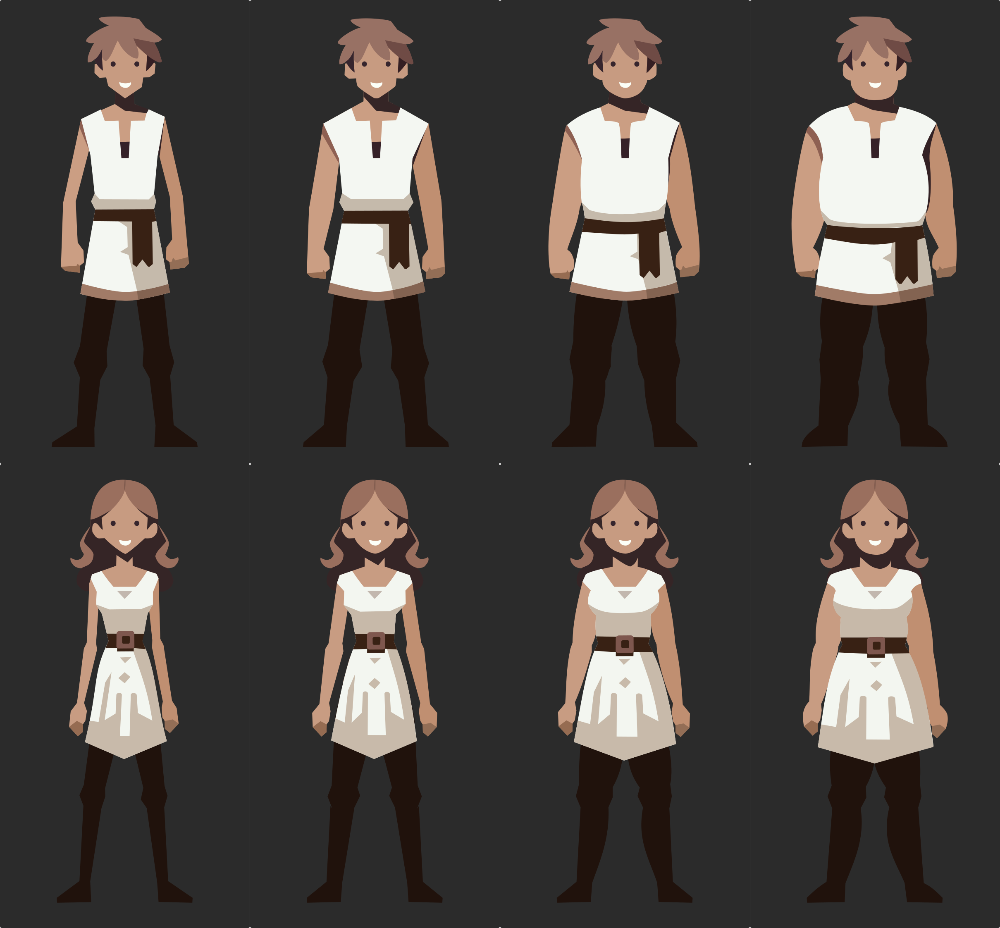

    

<h1 align="center">
(preview version)  mobile diet application with RPG elements
</h1>

**DietVenture** combines the functions of a diet application with an RPG, where healthy habits build a virtual character. Tracking your diet and physical activity directly affects your avatar's attributes, which determines its success in text adventures. 

This is a project from university and my first mobile app created using Expo and React Native. As this is my debut in app development, the code is not perfect :sweat_smile: and probably needs a number of improvements. I am also considering switching to TypeScript to improve further app development.

<h2 align="center"> Diet tracking </h2>

 

The app's **meals section** offers intuitive diet management tools, making it easy for users to plan and monitor their intake on a daily basis. Features include:

- Convenient date selection through a calendar with a scrolling week option, making it easy to plan meals ahead.

- Adding products to a specific meal is easy with an integrated search engine that makes it easy to find and select the right ingredients.

- Adjust the weight of a product or remove it from a meal altogether

- The ability to view basic nutritional values for individual meals and the total balance for the day.

    

 

An integral part of the app is the day's summary screen, which presents a detailed analysis of the nutritional values of the meals consumed.

    

<h2 align="center"> Virtual Character </h2>

Based on the body measurements entered by the user, the app creates a virtual figure to reflect the user's progress.

    

<h3 align="center"> Silhouettes </h3>

The character's silhouette is selected based on the user's gender and BMI.

    

<h3 align="center"> Attributes </h3>

The character's attributes are fully dependent on the user's eating habits and physical activity.

- Strength, agility and endurance, directly depend on the physical activities registered in the app. Strength training affects strength, cardio training increases endurance, and both types of training equally affect agility.

- Other attributes depend on meeting the recommended daily requirement for vitamins and minerals, where each micronutrient is linked to a corresponding attribute based on its real-world effects on the body. For example, vitamin A, known for its beneficial effects on vision and regenerative abilities, is correlated with the attributes of perception and regeneration.

<h3 align="center"> Statistics </h3>

| Attribute | Effect |
|---|---|
| Strength | :arrow_right: Attack damage |
| Agility |:arrow_right: Armor class |
| Endurance | :arrow_right: Frequency of challenges in the text-based game |
| Vitality | :arrow_right: Max health points |
| Regeneration | :arrow_right: Health points regeneration rate |
| Other | :arrow_right: Value added to the dice roll in text-based game challenges |

<h2 align="center"> Text-based Game </h2>

The final element of the app is a text-based game that allows you to send your character on journeys where he or she will encounter various challenges. The mechanism of the game is simple, making most of the action happen in the background, between sessions in the app.

    

<h3 align="center"> Health, Energy and Gold </h3>

Character loses health points during travel battles and failures in challenges. Wounds are healed between trips.

To run a trip, a character must have energy, which decreases on a running basis during the day and is replenished by adding meals in the app.

Success in events rewards the user with gold, at this point it has no use yet but in the future it may be used to buy equipment or cosmetic items.

<h3 align="center"> Events </h3>

They include challenges and battles with opponents.

- **Challenges** are focused on dice rolls; if the rolled number is equal to or higher than the difficulty of the challenge, it will end in success. Each challenge is linked to one of the character's attributes, and its value is added to the rolled number, increasing the chance of success.

- **Battles**, on the other hand, are based on turn-based exchanges of blows with the opponent. Here, the damage dealt by the character, armor class, and vitality are crucial.

<h2 align="center"> Database </h2>

The application uses the Food and Nutrient Database for Dietary Studies (FNDDS) from the United States Department of Agriculture (USDA), available at https://fdc.nal.usda.gov/download-datasets.html. This database has been optimized for efficiency and space minimization by removing irrelevant products and attributes and converting them to SQLite format. This customization not only simplifies complex queries to the product database, but also significantly reduces its size, which translates into application performance.